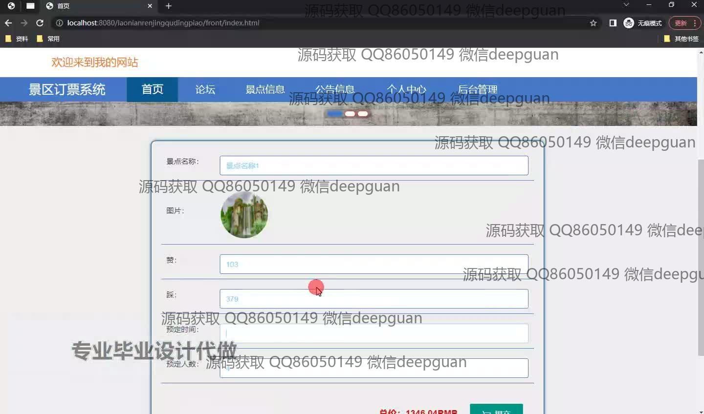
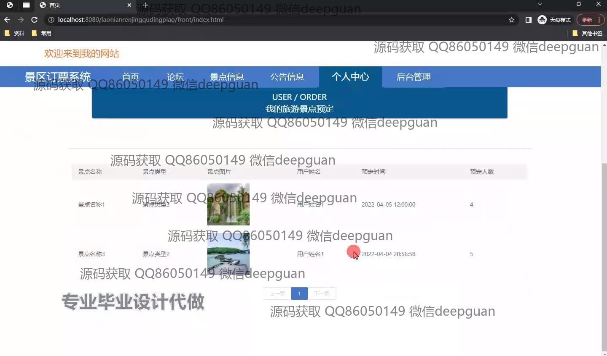
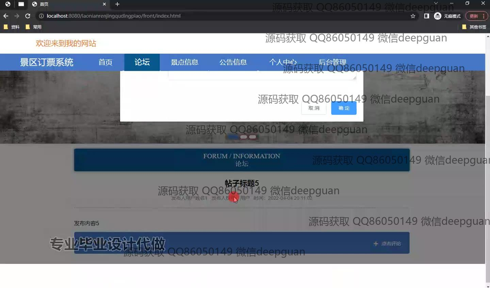
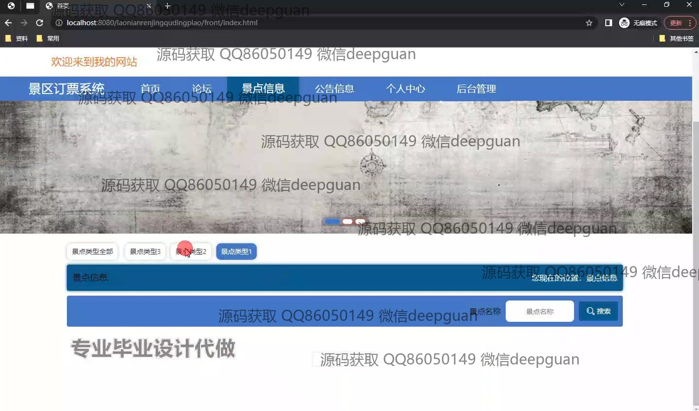
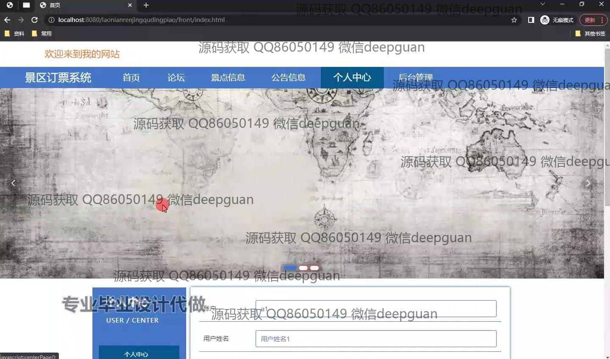
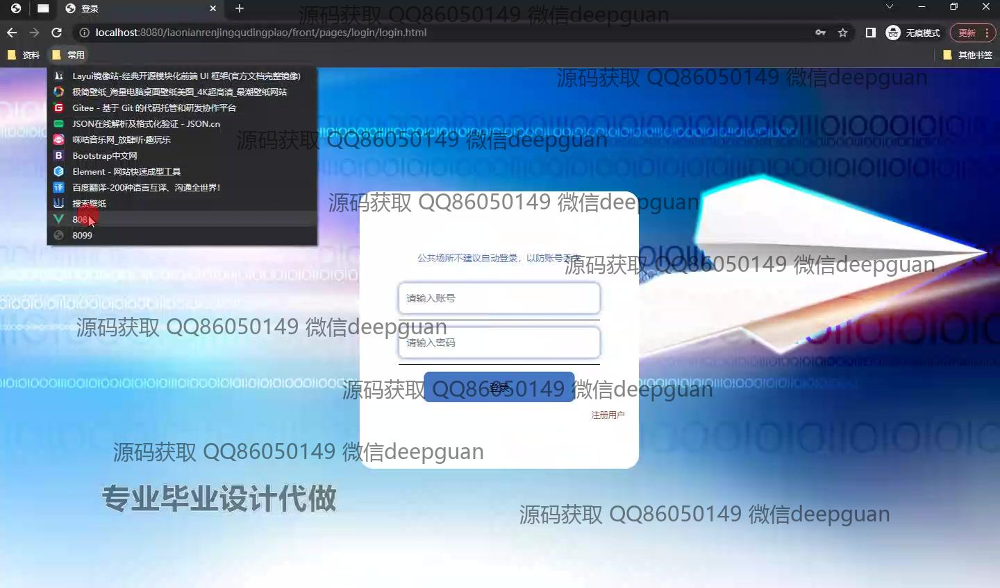
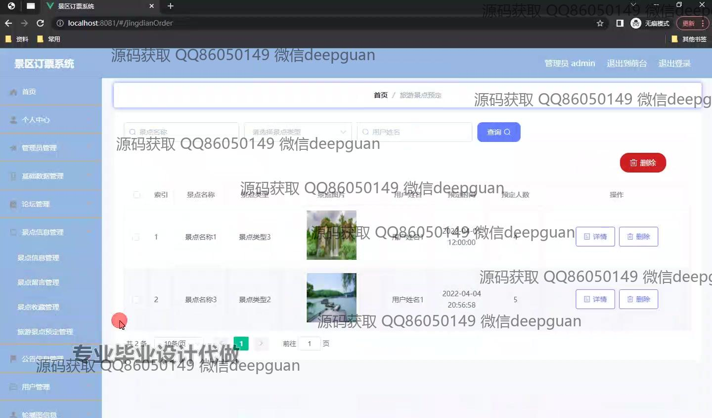

<h1 align="center">针对老年人的景区订票系统</h1>

## 简介
针对老年人的景区订票系统：角色分为管理员和用户；功能包括景点预定、个人中心、论坛交互、景点信息管理、预定记录筛选及总价计算，界面设计简洁友好，增强用户体验和互动。    --计算机毕业设计源码；毕设源码；java毕业设计源码

## 联系方式

<h3 align="center">获取完整代码与数据库文件 + 微信：deepguan QQ: 86050149 QQ群: 783742310</h3>

<h3 align="center">可帮忙远程部署 包运行成功！提供远程部署、修改代码、设计文档指导、代码讲解等服务！</h3>

## 功能介绍（完整见运行截图）
管理员： 基本功能：管理员管理，景点信息管理，论坛管理。个人中心：查看与删除预定记录，按景点名称、类型和用户名筛选。论坛管理：查看和删除帖子、查看回复，新增功能按钮。用户： 基本功能：登录，注册，论坛互动。网站首页：主导航栏，景点信息搜索，景点类型筛选。订票：景点名称与类型查询，图片展示，价格输入，预定时间和人数选择，总价计算。个人中心：查看旅游景点预定信息，包含景点详情与预定时间、人数，留言与回复功能。

## 运行截图

本代码来源于网络,仅供学习参考使用!

